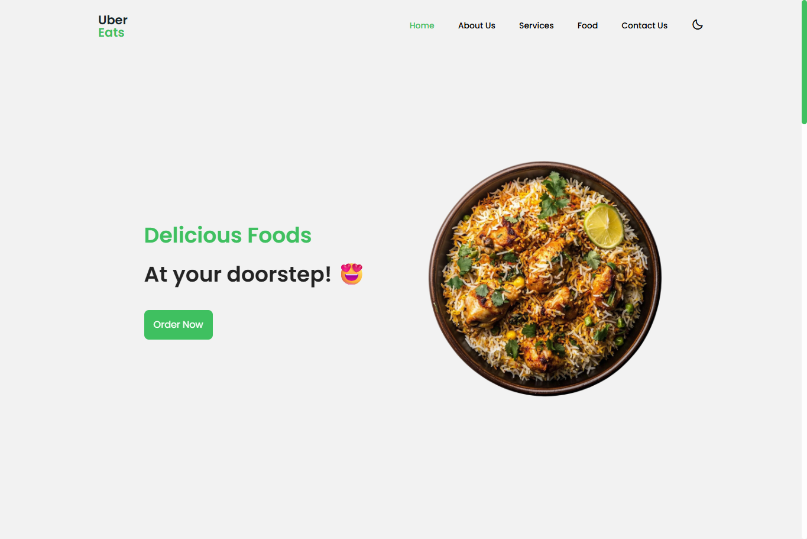

<!---->

# UberEats - Responsive App Landing Page

This project was created by: <strong>Rimaz Ahamed</strong>, 09/2025,.

## Copyright & Disclaimer

This project is created **for educational and personal learning purposes only**.  
It is a **clone of the UberEats concept** and is **not affiliated with, endorsed by, or connected to Uber Technologies Inc.** in any way.  

All trademarks, logos, and brand names used in this project are the property of their respective owners.  
No copyright infringement is intended — this repository is solely to practice and demonstrate web development skills.

